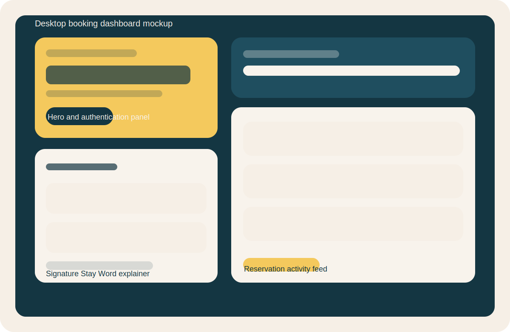

# DV200 - Interactive Development Assignment

Deluxe Bookings is a full-stack accommodation booking prototype built for the DV200 Interactive Development Assignment. The project combines a React frontend, an Express API, MongoDB-ready persistence, and JWT authentication enhanced with a second creative credential called a Signature Stay Word.

## Project Description

The app presents a premium booking dashboard where users can:

- create an account
- sign in with JWT authentication
- confirm identity with a Signature Stay Word
- view recent bookings
- create new suite reservations

The backend is MongoDB Atlas ready, but it also includes a demo fallback mode so the project can still be reviewed locally before Atlas credentials are configured.

## Tech Stack

- Frontend: React.js + Vite
- Backend: Node.js + Express
- Database: MongoDB with Mongoose, designed for MongoDB Atlas
- Authentication: JWT + Signature Stay Word
- Version Control: Git + GitHub

## Repository Expectations

- Create the GitHub repository as a public repo named `DV200-Interactive-Development-Assignment`
- Push all source code from this workspace
- Use frequent, meaningful commits across setup, auth, bookings, styling, and documentation
- Add `Tsungai-OW` as a collaborator from GitHub repository settings

I could not add the collaborator from this local workspace because that requires a live GitHub repository plus authenticated account access.

## Creative Auth Explanation

Alongside the usual email and password, each user creates a private Signature Stay Word during registration. Logging in requires all three pieces of information:

1. email
2. password
3. signature stay word

This acts like a lightweight personalized second factor that fits the hotel theme. It is stored as a secure hash in the backend, just like the password.

## Installation Instructions

### 1. Install dependencies

```bash
npm install
cd mern-frontend && npm install
cd ../mern-backend && npm install
```

### 2. Configure environment variables

Create these files:

- `mern-frontend/.env`
- `mern-backend/.env`

Use the provided `.env.example` files as the starting point.

### 3. Start the backend

```bash
cd mern-backend
npm run dev
```

### 4. Start the frontend

```bash
cd mern-frontend
npm run dev
```

### 5. Optional Atlas setup

Set `MONGODB_URI` in `mern-backend/.env` to your MongoDB Atlas connection string if you want a persistent database. If this is omitted, the backend starts an in-memory MongoDB instance so the UI and API can still be reviewed.

## Demo Credentials

If you run the backend without MongoDB, a seeded demo account is available:

- Email: `demo@deluxebookings.com`
- Password: `Password123!`
- Signature Stay Word: `Aurora`

## Screenshots / Mockups

Desktop mockup:



Mobile mockup:


## Project Structure

```text
.
├── mern-backend
│   ├── config
│   ├── controllers
│   ├── middleware
│   ├── models
│   ├── routes
│   ├── services
│   ├── utils
│   ├── app.js
│   ├── server.js
│   └── .env.example
├── docs
├── mern-frontend
│   ├── src
│   └── .env.example
├── .gitignore
├── package.json
└── README.md
```

## Suggested Commit Sequence

Use a commit history similar to this:

1. `chore: scaffold frontend and backend`
2. `feat: add jwt auth with signature stay word`
3. `feat: add bookings dashboard and api`
4. `docs: add setup guide and mockups`

## Available Scripts

From the repo root:

- `npm run dev:frontend`
- `npm run dev:backend`
- `npm run build`
- `npm run lint`

## Notes

- The backend exposes routes under `/api`
- JWT tokens are returned in the response body and also set as an HTTP-only cookie
- The frontend default API URL is `http://localhost:5001/api`
